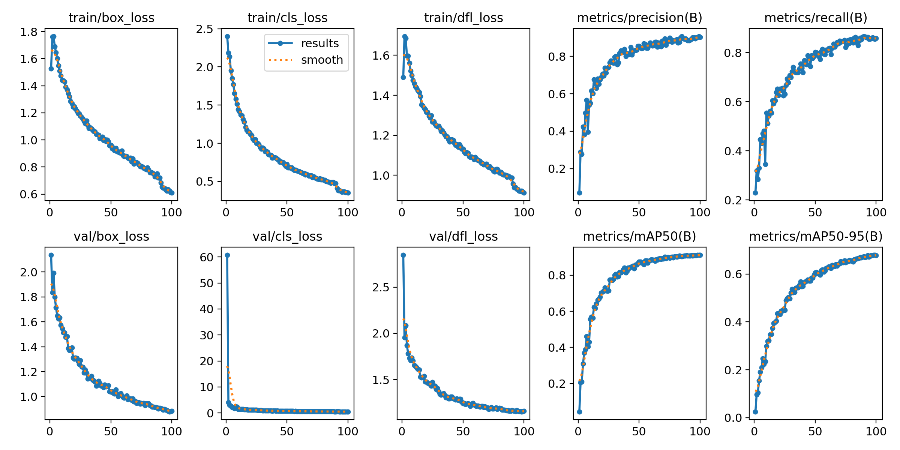
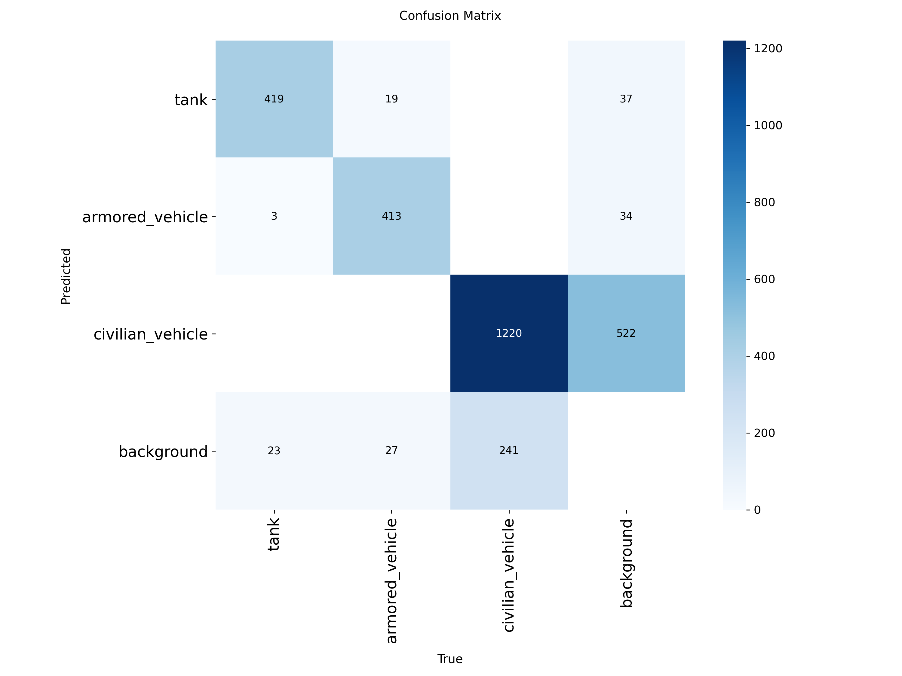
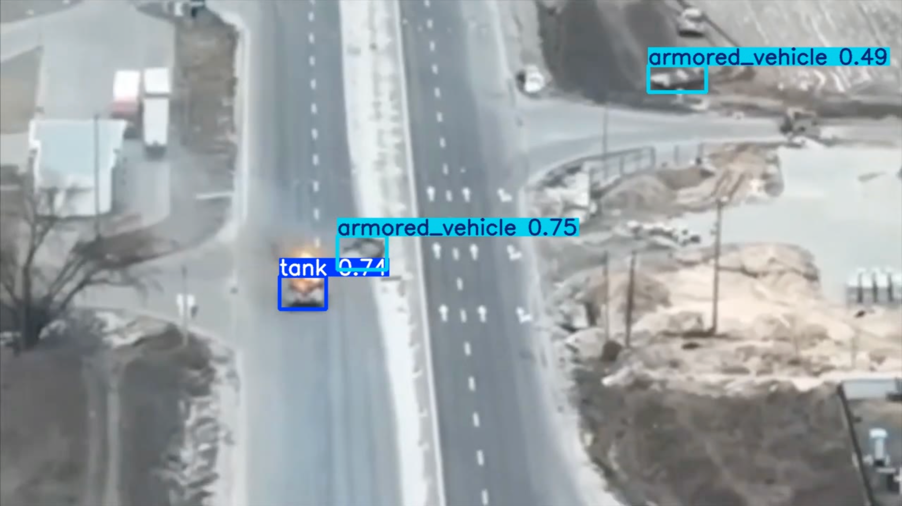
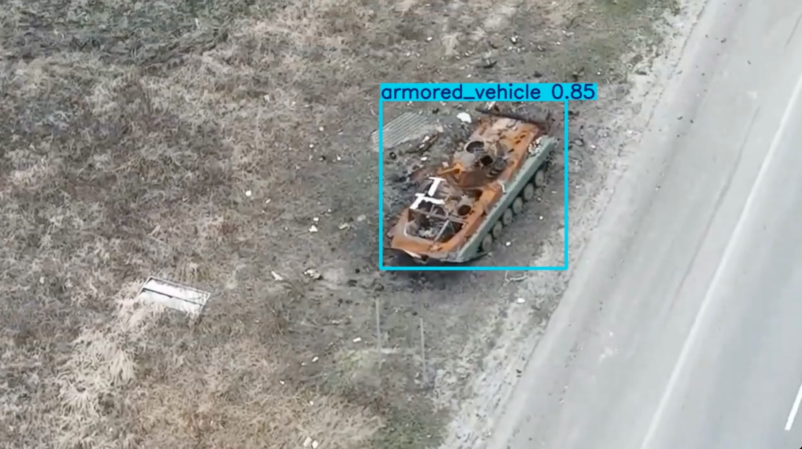
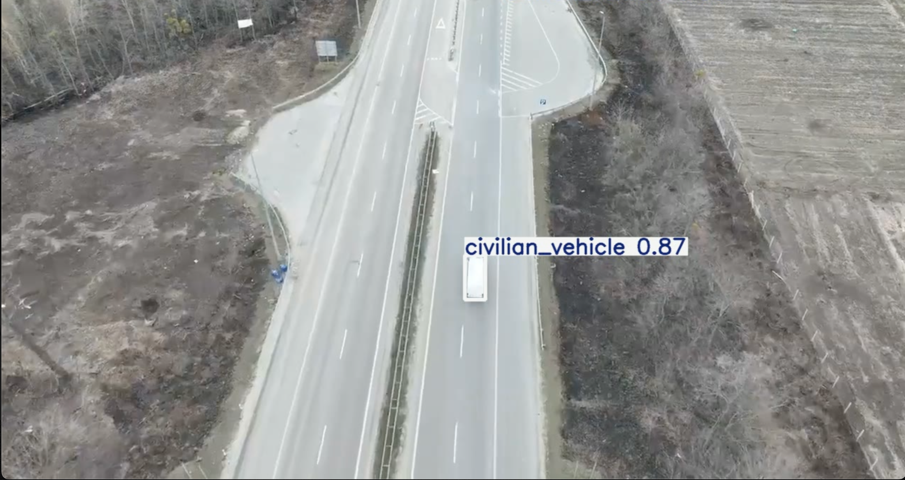

# UAV Vehicle Detection — Military & Civilian Vehicles from Aerial Imagery

> YOLO11-based UAV vehicle detection system for military and civilian vehicle
> classification from aerial (drone) imagery.

<p align="left">
  
  
  
  
  
</p>

---

## Overview

This repository contains the full research and engineering pipeline for an
**Unmanned Aerial Vehicle (UAV) vehicle detection system**. The goal is to
detect and classify ground vehicles in aerial/drone footage into three classes:

| ID | Class             | Description                                              |
|----|-------------------|----------------------------------------------------------|
| 0  | `tank`            | Main battle tanks (e.g. T-72, T-90).                     |
| 1  | `armored_vehicle` | Armored fighting vehicles (BMP, BTR, MT-LB, APC, IFV).  |
| 2  | `civilian_vehicle`| Non-military civilian road vehicles.                     |

The project goes well beyond model training: it covers **custom dataset
construction** from three heterogeneous public sources, rigorous **data
cleaning and balancing**, **leakage analysis**, **hard-case mining** from
real-world UAV videos, and a comparative study of three YOLO11 model scales.

The final detector reaches **mAP@50 = 0.911** and **mAP@50–95 = 0.680** with
**YOLO11m**.

---

## Key Features

- **Custom 3-class dataset** purpose-built for aerial military/civilian vehicle detection.
- **Multi-source dataset integration** across Russian Military, Aboba, and VisDrone.
- **Automated class remapping** from dozens of source labels into 3 unified classes.
- **Dataset balancing & deduplication** (perceptual-hash near-duplicate removal).
- **Train/Val/Test split leakage analysis** (exact + near-duplicate cross-split checks).
- **Hard-case mining** from real UAV videos to surface model failure modes.
- **Small-object detection analysis** for high-altitude aerial frames.
- **Real-world UAV video validation** beyond static benchmark images.
- **Reproducible pipeline** — every stage is a documented, runnable script.

---

## Dataset Construction Pipeline

The dataset is assembled from three public sources and normalized into a single
YOLO-format dataset through a fully scripted pipeline:

```
 Source datasets            Per-source cleaning              Merge & split
┌──────────────────┐      ┌────────────────────────┐      ┌────────────────┐
│ Russian Military │──┐   │ 1. Remove empty labels │      │  Stratified    │
│ Aboba            │──┼──▶ │ 2. Drop invalid boxes  │ ──▶  │  70/20/10      │
│ VisDrone         │──┘   │ 3. Class remapping     │      │  train/val/test│
└──────────────────┘      │ 4. pHash deduplication │      └───────┬────────┘
                          │ 5. Class balancing     │              │
                          └────────────────────────┘              ▼
                                                          ┌────────────────┐
                                                          │ Leakage audit  │
                                                          │ + data.yaml    │
                                                          └────────────────┘
```

| Step | Stage                | Script                                   |
|------|----------------------|------------------------------------------|
| 1    | Dataset analysis     | `scripts/analyze_datasets.py`            |
| 2    | Class distribution   | `scripts/class_distribution.py`          |
| 3    | Class remapping      | `scripts/dataset_config.py`              |
| 4    | Cleaning & dedup     | `scripts/prepare_clean.py`               |
| 5    | Balancing (VisDrone) | `scripts/prepare_clean.py`               |
| 6    | Merge + split        | `scripts/prepare_merge.py`               |
| 7    | Leakage analysis     | `scripts/check_leakage.py`               |
| 8    | Final statistics     | `scripts/generate_final_stats.py`        |
| —    | Orchestrator         | `scripts/run_prepare_pipeline.py`        |

**Class remapping summary**

- **Russian Military** → all armored classes mapped to `armored_vehicle`.
- **Aboba** → `BMP/BMD`, `BTR`, `MT-LB` → `armored_vehicle`; `TANK` → `tank`.
- **VisDrone** → all civilian road-vehicle labels → `civilian_vehicle`; non-vehicle labels (e.g. pedestrians) removed.

---

## Dataset Statistics

**Final merged dataset: 4,524 images.**

| Class             | Instances |
|-------------------|----------:|
| `tank`            |     2,225 |
| `armored_vehicle` |     2,198 |
| `civilian_vehicle`|    10,139 |
| **Total**         | **14,562**|

**Split distribution (70 / 20 / 10, stratified by dominant class):**

| Split | Images | tank | armored_vehicle | civilian_vehicle |
|-------|-------:|-----:|----------------:|-----------------:|
| train |  3,166 | 1,570 | 1,530          | 6,977            |
| val   |    904 |   445 |   459          | 1,978            |
| test  |    454 |   210 |   209          | 1,184            |

> Full per-source breakdowns are in [`reports/`](reports/).

---

## Model Comparison

Three YOLO11 scales were trained and evaluated on the held-out test split.

| Model    | Params (scale) | mAP@50 | mAP@50–95 |
|----------|----------------|-------:|----------:|
| YOLO11n  | nano           |  0.900 |     0.644 |
| YOLO11s  | small          |  0.909 |     0.676 |
| **YOLO11m** | **medium**  | **0.911** | **0.680** |



---

## Methodology Summary

1. **Source analysis** — inventory each dataset's images, labels, classes, and label health.
2. **Class unification** — remap heterogeneous source labels onto 3 final classes.
3. **Cleaning** — remove empty/invalid labels and out-of-bounds boxes.
4. **Deduplication** — perceptual-hash clustering to drop near-duplicate frames.
5. **Balancing** — downsample VisDrone civilians to keep class ratios usable while preserving image diversity.
6. **Merging & splitting** — stratified 70/20/10 split into a single YOLO dataset.
7. **Leakage audit** — verify no image (exact or near-duplicate) crosses splits.
8. **Training** — train YOLO11n/s/m under identical settings.
9. **Evaluation** — compare mAP@50 and mAP@50–95 on the test split.
10. **Hard-case mining** — mine real UAV videos for uncertain predictions and feed reviewed crops back into training.

---

## Results

**YOLO11m** was selected as the final model. While all three scales perform
comparably on mAP@50 (0.900 → 0.911), the medium model delivers the best
**mAP@50–95 (0.680)** — the stricter, localization-sensitive metric — indicating
tighter bounding boxes across IoU thresholds. The gain from `s` → `m` is small
(+0.004 mAP@50–95) but consistent, and `m` remains lightweight enough for
practical UAV/edge deployment, making it the best accuracy-vs-cost trade-off.

| Artifact          | Location                              |
|-------------------|---------------------------------------|
| Confusion matrix  | `docs/confusion_matrix.png`           |
| Results curves    | `docs/results.png`                    |
| Final report      | `reports/final_report.pdf`            |
| Statistics report | `reports/final_statistics.md`         |
| Leakage report    | `reports/leakage_report.md`           |

**Confusion matrix (final YOLO11m model, test split):**



---

## Example Detections

Qualitative results from the final YOLO11m model, one per class:

| `tank` | `armored_vehicle` | `civilian_vehicle` |
|:------:|:-----------------:|:------------------:|
|  |  |  |

---

## Project Report

The full written project report (methodology, experiments, and analysis) is
available as a PDF:

**[reports/final_report.pdf](reports/final_report.pdf)**

---

## Repository Structure

```text
military-dataset/
├── README.md                  # this file
├── requirements.txt           # Python dependencies
├── data.yaml                  # YOLO dataset config (3 classes)
│
├── scripts/                   # dataset + mining pipeline (runnable)
│   ├── analyze_datasets.py
│   ├── class_distribution.py
│   ├── dataset_config.py
│   ├── prepare_clean.py
│   ├── prepare_merge.py
│   ├── run_prepare_pipeline.py
│   ├── check_leakage.py
│   ├── generate_final_stats.py
│   ├── mine_hardcases.py      # hard-case mining from UAV videos
│   ├── deduplicate.py
│   ├── create_grid.py
│   ├── review_hardcases.py    # interactive review (tank/armored/civilian)
│   ├── export_reviewed_hardcases.py
│   ├── merge_hardcases.py
│   └── ...
│
├── docs/                      # figures used in this README
│   ├── confusion_matrix.png
│   ├── confusion_matrix_normalized.png
│   ├── results.png
│   ├── tank_detection.png
│   ├── armored_vehicle_detection.png
│   └── civilian_vehicle_detection.png
│
└── reports/                   # generated analyses, metrics, and the report
    ├── README.md
    ├── final_report.pdf
    ├── final_statistics.md
    ├── leakage_report.md
    ├── class_distribution.md
    └── merged_class_distribution.md
```

> Raw datasets, merged data, training runs, and model binaries are intentionally
> **not** tracked (see `.gitignore`); only code, configs, docs, and reports are versioned.

---

## Getting Started

```bash
# 1. Environment
python -m venv .venv
source .venv/bin/activate
python -m pip install -r requirements.txt

# 2. Build the dataset (after placing sources under datasets/)
python scripts/run_prepare_pipeline.py

# 3. Train (YOLO11m example)
yolo detect train data=data.yaml model=yolo11m.pt imgsz=640 epochs=100

# 4. Validate
yolo detect val data=data.yaml model=runs/detect/train/weights/best.pt
```

### Hard-Case Mining (UAV video)

The detector occasionally mislabels armored vehicles as `civilian_vehicle` in
drone footage. The mining pipeline surfaces these and other uncertain
predictions from videos for human review and re-labeling:

```bash
# Mine uncertain detections from videos
python scripts/mine_hardcases.py --model models/best.pt --videos videos \
    --output hardcase_mining --mode hardcase_all

# Remove near-duplicate crops, then build a review grid
python scripts/deduplicate.py --crops hardcase_mining/crops --metadata hardcase_mining/metadata.csv
python scripts/create_grid.py --crops hardcase_mining/crops --metadata hardcase_mining/metadata_dedup.csv

# Review interactively, export to YOLO, and merge back into the dataset
python scripts/review_hardcases.py  --crops hardcase_mining/crops
python scripts/export_reviewed_hardcases.py --crops hardcase_mining/crops --output hardcase_mining/export
python scripts/merge_hardcases.py   --export hardcase_mining/export --merged merged_dataset
```

---

## Future Work

- Expand the `tank` and `armored_vehicle` sets with more geographic/sensor diversity.
- Add multi-altitude and thermal/IR imagery for robustness.
- Investigate tiled / SAHI inference for very small objects at high altitude.
- Export and benchmark TensorRT/ONNX for on-board UAV deployment.
- Temporal tracking (ByteTrack/BoT-SORT) for video-level vehicle counting.
- Active-learning loop using hard-case mining at scale.

---

## Citation

If you use this work, please cite:

```bibtex
@misc{uav_vehicle_detection,
  title        = {UAV Vehicle Detection: Military and Civilian Vehicle
                  Classification from Aerial Imagery using YOLO11},
  author       = {Aydin, Ali},
  year         = {2026},
  howpublished = {\url{https://github.com/<your-username>/military-dataset}},
  note         = {Undergraduate computer vision project}
}
```

This project builds on the following data sources and tools:

- **Ultralytics YOLO11** — https://github.com/ultralytics/ultralytics
- **VisDrone** dataset — https://github.com/VisDrone/VisDrone-Dataset
- Russian Military and Aboba aerial vehicle datasets.

---

## License

Released under the **MIT License** — see [`LICENSE`](LICENSE).

> Source datasets retain their own licenses; review each dataset's terms before
> redistribution. This repository's license applies only to the code and
> documentation it contains.
